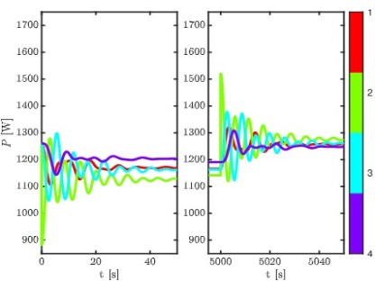
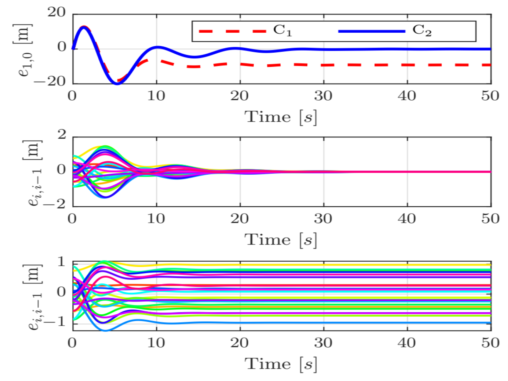
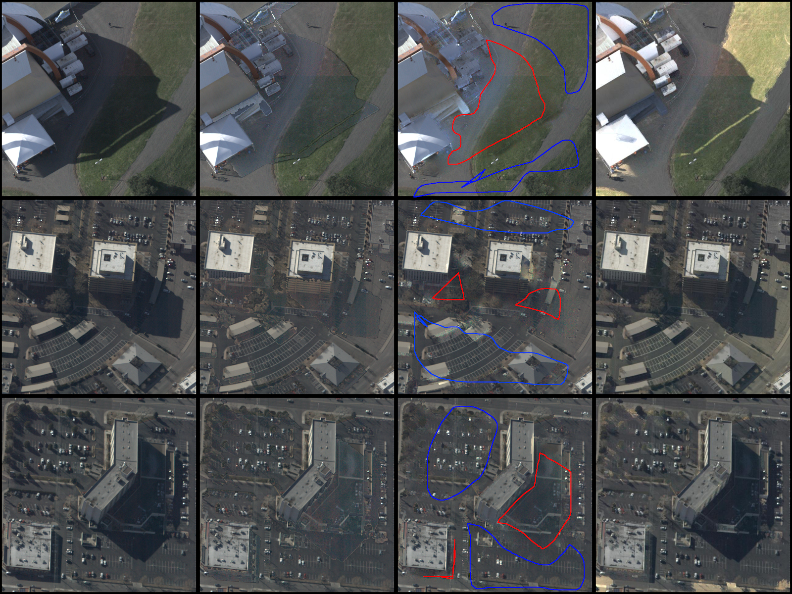

Selected publications and recent work across vehicle platooning, inverter-based microgrids, and aerial image processing.
{.page-description}

:::: {.publication-card}
::: {.columns .publication-columns}
::: {.column width="30%"}
{.feature-image fig-alt="Inverter chain illustration"}
:::

::: {.column width="70%"}
## String Stability in Microgrids Using Frequency Controlled Inverter Chains

G. F. Silva, A. Donaire, M. M. Seron, A. McFadyen and J. Ford · 2022 · *IEEE Control Systems Letters*
{.publication-meta}

Proposed a controller design that guarantees string stability in chains of inverters.

[DOI](https://doi.org/10.1109/LCSYS.2021.3114143)
:::
:::
::::

:::: {.publication-card}
::: {.columns .publication-columns}
::: {.column width="30%"}
{.feature-image fig-alt="Vehicle platooning illustration"}
:::

::: {.column width="70%"}
## String Stable Integral Control of Vehicle Platoons with Disturbances

G. F. Silva, A. Donaire, A. McFadyen and J. Ford · 2021 · *Automatica*
{.publication-meta}

Disturbance string stable control of vehicle platoons with disturbances.

[Journal DOI](https://doi.org/10.1016/j.automatica.2021.109542)

### Conference version

G. F. Silva, A. Donaire, A. McFadyen, and J. Ford, 2020, *59th IEEE Conference on Decision and Control (CDC)*.

[Conference DOI](https://doi.org/10.1109/CDC42340.2020.9303743)
:::
:::
::::

:::: {.publication-card}
::: {.columns .publication-columns}
::: {.column width="30%"}
{.feature-image fig-alt="Shadow compensation example"}
:::

::: {.column width="70%"}
## Near Real-Time Shadow Detection and Removal in Aerial Motion Imagery Application

G. F. Silva, G. B. Carneiro, R. Doth, L. A. Amaral and D. F. G. de Azevedo · 2018 · *ISPRS Journal of Photogrammetry and Remote Sensing*
{.publication-meta}

Presented a method to automatically detect and remove shadows in urban aerial images.

[DOI](https://doi.org/10.1016/j.isprsjprs.2017.11.005)
:::
:::
::::
